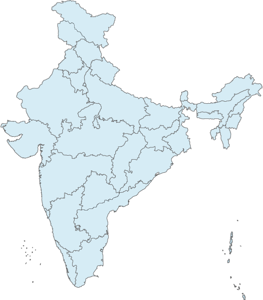
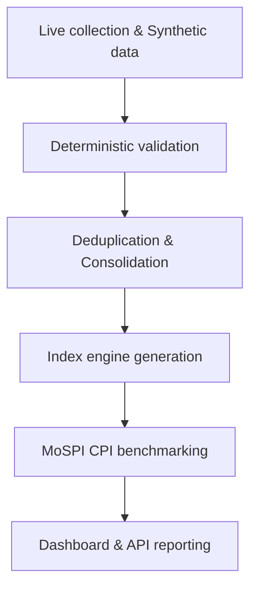
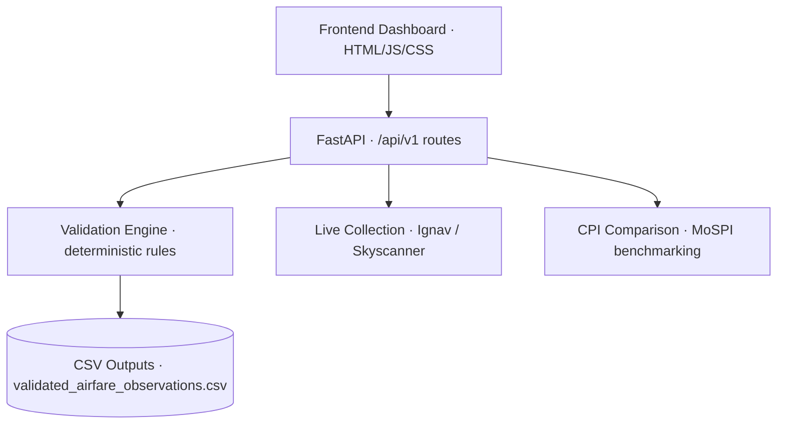

<div align="center">

# VAYU INDEX

### Real-time Airfare Price Index for India

**Deterministic Validation, Live Collection & Official CPI Comparison System**

Collection → Validation → Indexing → Comparison

[Overview](#overview) · [Capabilities](#platform-capabilities) · [Architecture](#system-architecture) · [Setup](#local-setup) · [Documentation](#api-documentation)

</div>

---

## Overview

**VAYU INDEX** is a comprehensive airfare indexing platform that connects raw flight observations with rigorous validation, anomaly detection, and official MoSPI domestic-airfare CPI comparison metrics. It answers exactly one critical question per record before indexing: *"Is this observation structurally and logically usable?"*

The platform brings these records into a single workspace for route coverage analysis, validation diagnostics, API-driven insights, and evidence-based reporting.

> **Measure real market trends with validated integrity.**



*Dashboard preview showing Vayu prototype analysis and route coverage metrics. Displayed figures are illustrative records, not official statistics.*

## The indexing workflow

Data collection is one milestone in a longer statistical journey. The platform follows recorded observations across validation, indexing, and official comparison.



## Platform capabilities

| Workspace / Module | Purpose | Available functions |
|---|---|---|
| **Validation Engine** | Structural data integrity | Deterministic rules, missing field checks, logical date/fare checks, and edge-case logging |
| **Live Collection** | Fetch real-time market data | Opt-in self-service Ignav collector and legacy Skyscanner connector |
| **CPI Comparison** | Benchmark against official stats | Exact-month MoSPI domestic-airfare CPI comparison, correlation vs DGCA, and rebased gap analysis |
| **Dashboard Interface** | Visualize cohort outcomes | Route coverage, prototype fare history, anomaly diagnostics, and API console |

## Interface gallery

The interface uses modern design themes, intuitive metric cards, and responsive layouts to support comprehensive data analysis.

<details>
<summary><strong>Data Quality — anomaly and coverage diagnostics</strong></summary>

*Displays validation status, missing field tracking, and authorized data sources.*

</details>

<details>
<summary><strong>CPI Validation — exact-month MoSPI benchmarking</strong></summary>

*Plots the bundled official MoSPI airfare CPI history and shows latest index movements.*

</details>


## System architecture

The browser communicates with the FastAPI backend through the `/api/v1` routes. A backend-injected bridge loads the snapshot into all supplied pages, wires the API console, and reports insufficient CPI overlap.



### Technology stack

| Layer | Implementation |
|---|---|
| User interface | HTML, Vanilla CSS, and JavaScript (Backend-injected bridge) |
| API | Python, FastAPI, and Uvicorn |
| Data validation | Python (Pandas) and explicit deterministic rules |
| Persistence | CSV flat files (Outputs & Official Data) |
| Reporting | API-generated summaries and dashboard rendering |

## Reading the dashboard

| Indicator | Interpretation |
|---|---|
| **Validation Status** | Breakdown of `VALID`, `INVALID`, and `NON_PRICE_AVAILABILITY` records |
| **MoM correlation** | Pearson correlation of month-over-month changes against official CPI |
| **Average MoM gap** | Absolute percentage point difference in monthly changes |
| **Live quotes** | Readiness and availability of live quotes from authorized sources |

**Filter scope:** The API responses identify the backend data as a **SYNTHETIC PROTOTYPE**, **NOT OFFICIAL**, with **LIVE COLLECTION NOT STARTED** and **PRODUCTION BACKTEST REQUIRED**.

## Local setup

### Prerequisites

- Python with `pip` and the dependencies listed in `requirements-phase14.txt`.
- Git to clone the repository.

### 1. Install dependencies

```bash
pip install -r requirements-phase14.txt
pip install pandas pytest
```

### 2. Run validation & tests

```bash
python scripts/run_validation.py
pytest tests/test_validation.py -v
```

### 3. Start the application

```bash
python scripts/run_api.py --check
python scripts/run_api.py --host 127.0.0.1 --port 8000
```

Open **http://127.0.0.1:8000** or **http://127.0.0.1:8000/dashboard** in your browser. The backend serves the frontend directly.

### API documentation

| Interface | Local URL |
|---|---|
| Web application | http://127.0.0.1:8000 |
| Index history | http://127.0.0.1:8000/api/v1/index |
| Route coverage | http://127.0.0.1:8000/api/v1/routes |
| CPI comparison | http://127.0.0.1:8000/api/v1/cpi-comparison |
| Data quality | http://127.0.0.1:8000/api/v1/data-quality |

## Demonstration scope

This project is an evaluator-facing prototype using synthetic observations and demonstration workflows.

- **Data:** The dataset in `data/synthetic/` is exactly what Phase 1 delivered.
- **MoSPI Reference Data:** The file `data/official/mospi/raw/cpi_1822(final).xlsx` is preserved exactly as received and never modified.
- **Validation:** deterministic rules flag records as usable or unusable but do not remove duplicates (which occurs in Phase 3).
- **Known upstream defect:** Phase 1 generator undercounted `advance_purchase_days` by 1 day on almost every row. The validator correctly flags this inconsistency.

## Validation output fields

Every row in `outputs/validated_airfare_observations.csv` keeps all original Phase 1 fields untouched, plus:
- `is_valid` (`True`/`False`)
- `validation_status`
- `validation_reason`
- `validation_errors` (e.g., `MISSING_SOURCE;MISSING_TOTAL_FARE`)

---

<div align="center">

**VAYU INDEX**

*Every observation validated. Every index accurate.*

</div>
