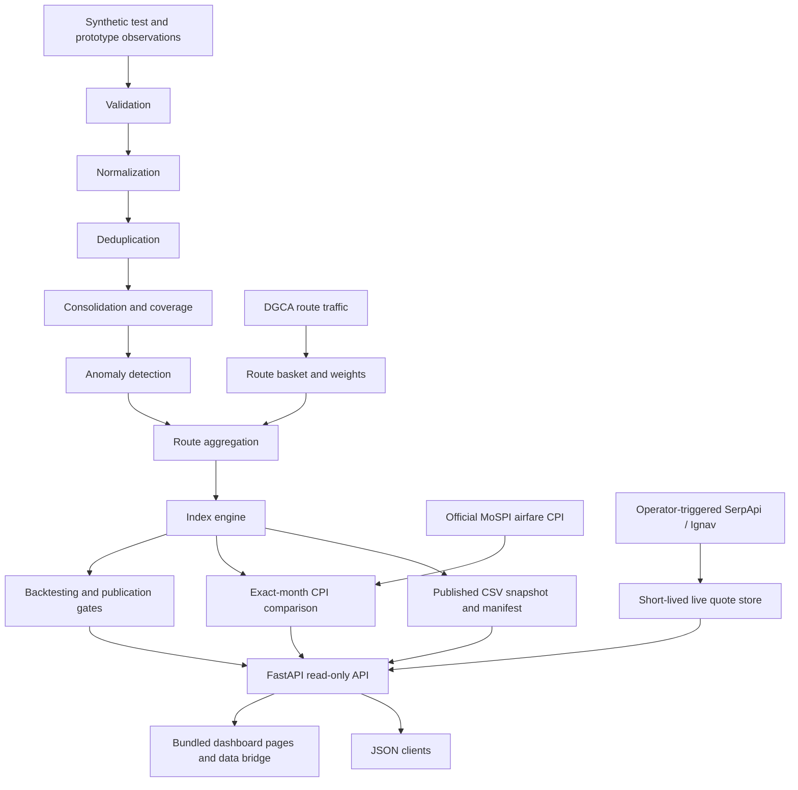

# Vayu Index Backend

Vayu Index is a backend and bundled dashboard prototype for tracking airfare prices across a fixed basket of 15 domestic routes in India. The backend includes a staged airfare data pipeline, a read-only FastAPI service, a browser dashboard, an official MoSPI airfare CPI reference series, and optional operator-triggered live quote collectors.

> **Current data status:** The bundled Vayu index snapshot is a synthetic prototype and is not an official market index or MoSPI CPI. SerpApi and Ignav can collect live route/date fare quotes when configured. Live quotes are short-lived observations; they do not automatically become historical index rounds or CPI comparison data.

## Project scope

The backend supports these stages:

1. Validate source observations and report structural or logical issues.
2. Normalize fares, routes, carriers, fare classes, and booking windows.
3. Deduplicate repeated captures and comparable economic records.
4. Consolidate eligible observations and assess source coverage.
5. Detect fare anomalies for review.
6. Aggregate route and booking-window series.
7. Calculate basket-weighted route, period, and collection-round indices.
8. Backtest available history and report coverage and production gates.
9. Serve the published snapshot, diagnostics, CPI comparison, and dashboard through a versioned API.

The monitored route basket is: `BOM-DEL`, `BLR-DEL`, `BLR-BOM`, `DEL-HYD`, `DEL-PNQ`, `CCU-DEL`, `AMD-DEL`, `DEL-MAA`, `BOM-HYD`, `BLR-CCU`, `DEL-SXR`, `DEL-GOI`, `DEL-GAU`, `BLR-COK`, and `DEL-IDR`.

## Architecture



At API startup, the repository loads and validates the manifest-referenced CSV tables into a consistent in-memory snapshot. API requests adapt that snapshot into JSON responses; they do not rerun the analytical pipeline. Live quote collection is a separate CLI operation and is stored apart from published historical index inputs. The dashboard files are bundled under `src/dashboard/static/vayu_frontend/` and served by the backend with a runtime data bridge.

## Project structure

```text
backend/
├── config/                   # Basket, mappings, source policy, API and publication manifests
├── data/
│   ├── official/
│   │   ├── dgca/             # DGCA traffic source files and processed route-basket data
│   │   └── mospi/            # Official airfare CPI workbook and processed series
│   └── synthetic/            # Synthetic prototype observations and edge cases
├── docs/                     # Methodology, API, data-source, and deployment documentation
├── outputs/                  # Versioned pipeline results and published snapshot tables
├── scripts/                  # Pipeline, API, verification, and live-collection commands
├── src/
│   ├── validation/           # Observation rules and validation reports
│   ├── normalization/        # Canonical fare and route fields
│   ├── deduplication/        # Capture and economic duplicate handling
│   ├── consolidation/        # Cross-source record consolidation
│   ├── anomaly_detection/    # Fare anomaly detection
│   ├── route_aggregation/    # Route and booking-window series
│   ├── index_engine/         # Route, period, and round index calculations
│   ├── backtesting/          # Historical metrics and production gates
│   ├── collection/           # Provider adapters, live clients, budgets, persistence
│   ├── api/                  # FastAPI routes, settings, repository, snapshot, services
│   └── dashboard/            # Dashboard router, template, static pages, frontend bridge
├── tests/                    # Automated tests and fixtures
├── .env.example              # Environment variable names and safe defaults; no real keys
├── Dockerfile                # Hardened API container image
├── docker-compose.yml        # Local container setup and persistent live-quote volume
├── requirements-phase14.txt  # Runtime dependencies
└── requirements-dev.txt      # Development and test dependencies
```

Key API implementation files are `src/api/main.py` (route registration), `src/api/config.py` (settings and API versions), `src/api/repository.py` and `src/api/snapshot.py` (published data loading), and `src/api/services/` (response shaping and CPI comparison). The publication manifest is `config/phase14_publication_manifest.json`.

## Run locally

Requires Python 3.11 or newer. From this `backend/` directory in PowerShell:

```powershell
py -m venv .venv
.\.venv\Scripts\Activate.ps1
py -m pip install -r requirements-phase14.txt
py scripts/run_api.py --check
py scripts/run_api.py --host 127.0.0.1 --port 8000
```

Keep the server terminal open, then use:

| Page | Local address |
|---|---|
| Dashboard | <http://127.0.0.1:8000/ui/> |
| Dashboard API page | <http://127.0.0.1:8000/ui/api.html> |
| Swagger / OpenAPI UI | <http://127.0.0.1:8000/api/v1/docs> |
| API health | <http://127.0.0.1:8000/api/v1/health> |

No live-provider key is needed to start the API or view the bundled prototype snapshot.

## API details

The API base path is **`/api/v1`**. Data routes use `GET`; they do not trigger fare collection. Most responses have the form:

```json
{
  "meta": {
    "api_version": "v1",
    "response_schema_version": "phase14-api-v1",
    "data_status": "SYNTHETIC_PROTOTYPE",
    "official_status": "NOT_OFFICIAL",
    "is_real_market_collection": false,
    "publication_class": "PUBLISHED",
    "request_id": "request-id",
    "source_files": []
  },
  "data": {}
}
```

`meta` also carries pipeline versions and the snapshot publication timestamp. Error responses contain `error_code`, `message`, `details`, `request_id`, and `api_version`. List endpoints accept `limit` (1–1000, default 100) and `offset` (default 0) where applicable. Swagger at `/api/v1/docs` shows the generated OpenAPI schema.

| Method and path | Returned information | Query parameters |
|---|---|---|
| `GET /health` | API health and uptime | — |
| `GET /status` | Snapshot, index, live collection, and backtest statuses | — |
| `GET /metadata` | Basket and publication metadata | — |
| `GET /frontend-data` | Combined dashboard data | — |
| `GET /cpi-comparison` | Vayu/MoSPI exact-month comparison and qualification status | — |
| `GET /index` | Index history, or route series if `route` is set | `route`, `variant`, `start`, `end`, `limit`, `offset` |
| `GET /index/latest` | Latest index point | `variant` |
| `GET /index/history` | Paginated index history | `variant`, `start`, `end`, `limit`, `offset` |
| `GET /index/period` | Period-grain index rows | `variant`, `grain`, `period_id`, `limit`, `offset` |
| `GET /index/coverage` | Basket coverage for a round | `variant`, `round_id` |
| `GET /routes` | Monitored basket and route coverage | `coverage_status`, `route`, `limit`, `offset` |
| `GET /routes/{route_id}` | Details for one monitored route | `variant` |
| `GET /routes/{route_id}/history` | History for one route | `fare_class`, `apw`, `start`, `end`, `limit`, `offset` |
| `GET /fares` | Dashboard fare history | `route`, `fare_class`, `apw`, `start`, `end`, `limit`, `offset` |
| `GET /lead-time` | Fare summary by booking window | `route`, `apw`, `limit`, `offset` |
| `GET /data-quality` | Validation, anomaly, and coverage diagnostics | `variant` |
| `GET /sources` | Source registry and authorization/compliance status | — |
| `GET /collection/status` | Published collection runs and coverage | — |
| `GET /collection/live` | Preferred live-provider status and available fresh quotes | — |
| `GET /collection/serpapi` | SerpApi readiness, quote counts, and price insights | — |
| `GET /collection/ignav` | Ignav readiness and available quotes | — |
| `GET /collection/skyscanner` | Legacy Skyscanner readiness and quotes | — |
| `GET /backtest/status` | Backtest metrics and production gates | — |
| `GET /anomalies` | Filterable anomaly records | `severity`, `rule_id`, `route_id`, `recommended_review`, `limit`, `offset` |
| `GET /exports` | Export IDs and available formats | — |
| `GET /exports/{export_id}` | CSV or JSON dataset export | `format`, `variant`, `route_id`, `grain`, `period_id`, `round_id`, `severity`, `rule_id`, `coverage_status`, `start`, `end`, `fare_class`, `apw` |
| `GET /methodology` | Methodology document references | `phase` |

Example requests from PowerShell:

```powershell
Invoke-RestMethod http://127.0.0.1:8000/api/v1/health | ConvertTo-Json -Depth 6
Invoke-RestMethod 'http://127.0.0.1:8000/api/v1/routes?limit=100' | ConvertTo-Json -Depth 8
Invoke-RestMethod http://127.0.0.1:8000/api/v1/cpi-comparison | ConvertTo-Json -Depth 10
```

## Official MoSPI Reference Data

### What it is

The bundled source workbook is `data/official/mospi/raw/cpi_1822(final).xlsx`. It contains the official Consumer Price Index (CPI) series downloaded from India's [e-Sankhyiki portal](https://esankhyiki.mospi.gov.in/), operated by the Ministry of Statistics and Programme Implementation (MoSPI).

| Series field | Value |
|---|---|
| Base year | 2024 |
| Geography | All India |
| Sector | Combined |
| Division | Transport |
| Group | Passenger transport services |
| Class | Passenger transport by air |
| Sub-class | Passenger transport by air, domestic |
| Item | Airfare |
| Item code | `07.3.3.1.2.01` |
| Packaged coverage | January 2025 to July 2026 |

### Role in the VAYU project

This dataset is the official external benchmark for the airfare component. It is separate from Vayu's airfare quote observations and is not merged into the synthetic observation pipeline. It provides an authoritative MoSPI airfare CPI series for comparison with eligible Vayu monthly index values. The comparison uses exact calendar-month matches and the coverage rules implemented by the CPI comparison service; when there are not enough qualifying overlapping months, comparison metrics remain uncomputed.

### Source integrity and processed series

The original workbook is retained under `data/official/mospi/raw/`. Processing writes the tidy monthly table and provenance metadata to `data/official/mospi/processed/`. The transformation organizes fields and periods; it does not fill or interpolate missing CPI values. Processing code and validation are in `scripts/process_mospi_airfare_cpi.py` and `tests/test_mospi_processing.py`.

## Live SerpApi collection

SerpApi Google Flights collection is opt-in and operator-triggered. It sends bounded route/date searches to SerpApi using INR and the India locale. The API key is read from the backend process environment variable `SERPAPI_API_KEY`; it must never be added to frontend code or Git.

Set a key privately in the current PowerShell session, then use the account check and dry run before a live request:

```powershell
$secure = Read-Host "Paste SerpApi key" -AsSecureString
$env:SERPAPI_API_KEY = [System.Net.NetworkCredential]::new("", $secure).Password
py scripts/check_serpapi_account.py
py scripts/run_live_serpapi_collection.py --dry-run
py scripts/run_live_serpapi_collection.py --confirm-live --route DEL-BOM --max-searches 1
```

The account check does not consume a Google Flights search. The dry run makes no provider request. The final command may consume one search. Check quota before running the full basket. The collector writes short-lived files under `outputs/live_collection/`; this directory is ignored by Git. Full settings and command options are documented in [`docs/live_collection_serpapi.md`](docs/live_collection_serpapi.md).

## Tests and validation

Install development dependencies and run the project checks from this directory:

```powershell
py -m pip install -r requirements-dev.txt
py -m pytest tests/
py scripts/verify_phase14.py
```

Phase-specific processing commands are available under `scripts/`, including validation, normalization, deduplication, anomaly detection, consolidation, route aggregation, index calculation, and backtesting. Review the relevant methodology in `docs/` before regenerating published outputs.

## Deployment

The backend includes a Dockerfile and Docker Compose configuration. For a local container deployment:

```powershell
Copy-Item .env.example .env
docker compose config --quiet
docker compose up --build -d
```

Add real provider keys only to the local ignored `.env` file or deployment secret manager. Compose binds to localhost by default and uses a persistent volume for live quote artifacts. For host settings, CORS, public deployment, and quote persistence details, see [`docs/deployment.md`](docs/deployment.md).

## Related documentation

- [`docs/index_methodology.md`](docs/index_methodology.md) — Index construction
- [`docs/anomaly_detection_methodology.md`](docs/anomaly_detection_methodology.md) — Anomaly detection
- [`docs/backtesting_methodology.md`](docs/backtesting_methodology.md) — Backtesting and release gates
- [`docs/live_collection_serpapi.md`](docs/live_collection_serpapi.md) — SerpApi integration
- [`docs/live_collection_ignav.md`](docs/live_collection_ignav.md) — Ignav integration
- [`docs/live_collection_skyscanner.md`](docs/live_collection_skyscanner.md) — Skyscanner integration requirements
- [`docs/deployment.md`](docs/deployment.md) — Deployment configuration
