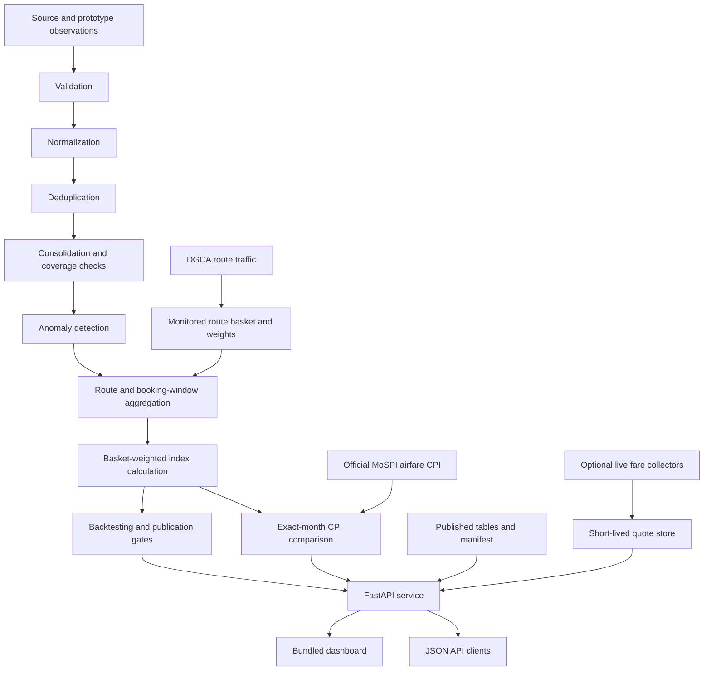
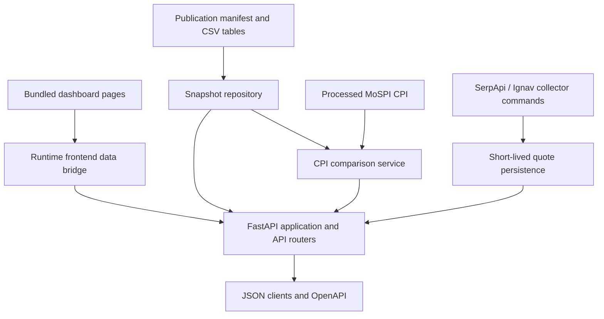

<div align="center">

# Vayu Index

### From Airfare Observations to Price Intelligence

**Airfare Price Intelligence & CPI Benchmarking Platform**

Route Fares → Index Movement → Anomaly Signals → MoSPI Comparison

**Smart India Hackathon 2026 · SIH26056**

[Overview](#overview) · [Platform](#platform-capabilities) · [Architecture](#system-architecture) · [Setup](#local-setup) · [Documentation](#api-documentation)

</div>

---

## Overview

**Vayu Index** is an airfare measurement prototype that tracks price movement across a fixed basket of 15 domestic routes in India. It organizes airfare observations into route and booking-window records, validates observations with deterministic structural and logical checks, detects unusual movements, calculates basket-weighted index series, and compares eligible monthly values with official MoSPI airfare CPI. Validation outcomes retain their status and reasons so records can be reviewed before they enter later pipeline stages.

The backend combines a reproducible data pipeline, a versioned FastAPI service, and the bundled browser dashboard. The currently published Vayu index snapshot is **synthetic prototype data**. It is not an official market index or MoSPI CPI. Optional live collectors can retrieve short-lived fares for specific routes and dates; those quotes do not automatically become historical index observations or CPI data.

> **Measure airfare movement with clear source, coverage, and data-status information.**


*Dashboard preview. The displayed figures are prototype snapshot values, not verified live fares or official statistics.*

## The airfare measurement workflow

Vayu processes observation records in defined stages. Official reference data, synthetic development data, live quote results, and published index outputs are kept distinct so users can understand where each value comes from.



## Platform capabilities

| Workspace or service | Purpose | Available functions |
|---|---|---|
| **Overview** | Review the current Vayu snapshot | Index level and change, trend chart, route fares, and monitored-basket status |
| **Validation engine** | Check whether each observation is usable | Required-field, date, fare, and logical-consistency checks with recorded outcomes and edge-case logging |
| **Anomaly Routes** | Inspect unusual airfare movements | Route filters, fare, expected range, deviation, severity, and India map |
| **Lead-Time Analysis** | Compare available fares by booking window | Route and advance-purchase summaries where observations exist |
| **Data Quality** | Review pipeline and source readiness | Validation results, route coverage, source status, and quality indicators |
| **CPI Validation** | Benchmark Vayu against the MoSPI airfare series | MoSPI history, exact-month overlap, coverage qualification, and comparison metrics |
| **API Console** | Explore backend data endpoints | Endpoint catalogue and request examples |
| **Live collection** | Request current route/date fare quotes | Optional provider collectors, account readiness, and quote status |
| **Data pipeline** | Reproduce analysis outputs | Validation, normalization, deduplication, anomaly detection, aggregation, index generation, and backtesting |

The monitored basket contains 15 routes: `BOM-DEL`, `BLR-DEL`, `BLR-BOM`, `DEL-HYD`, `DEL-PNQ`, `CCU-DEL`, `AMD-DEL`, `DEL-MAA`, `BOM-HYD`, `BLR-CCU`, `DEL-SXR`, `DEL-GOI`, `DEL-GAU`, `BLR-COK`, and `DEL-IDR`.

## Interface gallery

The bundled interface includes the Overview, Anomaly Routes, Lead-Time Analysis, Data Quality, CPI Validation, and API pages. The project screenshot above shows the Overview page. The route map image below is the map asset used by the dashboard for route context.

<details>
<summary><strong>India route map — dashboard map asset</strong></summary>


</details>

## Repository structure

The repository keeps the browser frontend in its own top-level `frontend/` folder. Backend source, configuration, data, scripts, outputs, and tests are separate top-level folders, so deployers can inspect and configure each part directly without a wrapper folder named `backend/`.

```text
Vayu-Index/
├── frontend/                 # Standalone dashboard pages and static assets
├── config/                   # API, route, provider, and publication configuration
├── data/                     # Official reference and synthetic input data
├── docs/                     # Methodology, deployment guides, and dashboard image
├── outputs/                  # Pipeline outputs and reports
├── scripts/                  # API, pipeline, collection, and verification commands
├── src/                      # API, dashboard, collection, and analysis modules
├── tests/                    # Automated checks and fixtures
├── .env.example               # Safe environment-variable template
├── Dockerfile
├── docker-compose.yml
├── requirements-dev.txt
└── requirements-phase14.txt
```
## System architecture

The browser uses the FastAPI application for dashboard data and API responses. At startup, the backend loads and checks the manifest-referenced tables into a consistent snapshot. Request handlers shape that snapshot into JSON; they do not rerun the analysis pipeline for each page request. Live collection is a separate operator action and writes short-lived quotes apart from the published index inputs.



### Technology stack

| Layer | Implementation |
|---|---|
| API | Python, FastAPI, and Uvicorn |
| Data processing | Python pipeline modules and CSV-based published tables |
| Configuration | JSON and CSV route, source, and publication manifests |
| Dashboard | Bundled static pages served by the backend |
| Live fare collection | Provider adapters, request budgets, and local quote persistence |
| CPI comparison | Processed official MoSPI airfare CPI and exact-month comparison rules |
| Deployment | Dockerfile and Docker Compose |
| Verification | Pytest suite and phase-specific verification scripts |

## Reading the dashboard

| Indicator | Interpretation |
|---|---|
| Vayu Airfare Price Index | Prototype index level calculated from the currently published route basket; it is not an official market index. |
| Route fare | A snapshot value unless the display identifies it as a fresh, verified provider quote. |
| Coverage and change | Route coverage and movement against available comparison observations; a missing prior round means no prior-round comparison is available. |
| Anomaly severity | Review category based on the observed fare range and deviation; it does not establish a pricing violation. |
| MoSPI CPI | Official monthly CPI reference series, kept separate from daily airfare quotes. |
| CPI comparison metrics | Computed only when exact-month overlap and coverage requirements are met. Insufficient overlap is reported without substituting sample values. |
| Live source status | Provider readiness and current quote availability. A configured key does not guarantee a successful search or available fare. |

Validation results distinguish usable observations from invalid records and non-price availability outcomes. A validation result records the status, reason, and any validation errors; validation does not imply that a fare is a verified live quote or official statistic.

## Local setup

### Prerequisites

- Python 3.11 or newer.
- PowerShell on Windows, or a compatible shell on macOS/Linux.
- Docker Desktop only when using the container setup.
- A provider key only for a live collection command; the bundled snapshot and dashboard do not require one.

### 1. Clone the project

```powershell
git clone https://github.com/saumya0723/Vayu-Index.git
cd Vayu-Index
```

### 2. Create an environment and install dependencies

```powershell
py -m venv .venv
.\.venv\Scripts\Activate.ps1
py -m pip install -r requirements-phase14.txt
```

### 3. Check and start the application

```powershell
py scripts/run_api.py --check
py scripts/run_api.py --host 127.0.0.1 --port 8000
```

Keep the server terminal open while using the site. The backend serves the bundled dashboard, so a separate frontend development server is not needed for normal use.

### API documentation

The API base path is **`/api/v1`**. Dashboard data endpoints use read-only `GET` requests. Live collection runs as an explicit command-line operation. Most successful responses contain `meta` fields for API version and data status plus a `data` object for the result. Errors include an error code, message, details, request ID, and API version.

| Interface | Local URL |
|---|---|
| Dashboard home | <http://127.0.0.1:8000/ui/> |
| Dashboard API page | <http://127.0.0.1:8000/ui/api.html> |
| Swagger UI | <http://127.0.0.1:8000/api/v1/docs> |
| ReDoc | <http://127.0.0.1:8000/api/v1/redoc> |
| OpenAPI schema | <http://127.0.0.1:8000/api/v1/openapi.json> |
| Health endpoint | <http://127.0.0.1:8000/api/v1/health> |

**Endpoint reference**

| Method and path | Purpose | Query parameters |
|---|---|---|
| `GET /health` | Liveness and uptime | — |
| `GET /status` | Snapshot, collection, index, and backtest status | — |
| `GET /metadata` | Basket and publication metadata | — |
| `GET /frontend-data` | Combined dashboard data bundle | — |
| `GET /cpi-comparison` | Exact-month Vayu/MoSPI comparison and qualification status | — |
| `GET /index` | Index history or a route series when `route` is supplied | `route`, `variant`, `start`, `end`, `limit`, `offset` |
| `GET /index/latest` | Latest index observation | `variant` |
| `GET /index/history` | Paginated index history | `variant`, `start`, `end`, `limit`, `offset` |
| `GET /index/period` | Period-grain index rows | `variant`, `grain`, `period_id`, `limit`, `offset` |
| `GET /index/coverage` | Route basket coverage for a collection round | `variant`, `round_id` |
| `GET /routes` | Monitored basket and route coverage | `coverage_status`, `route`, `limit`, `offset` |
| `GET /routes/{route_id}` | Details for one monitored route | `variant` |
| `GET /routes/{route_id}/history` | Fare history for one route | `fare_class`, `apw`, `start`, `end`, `limit`, `offset` |
| `GET /fares` | Fare observations for dashboard views | `route`, `fare_class`, `apw`, `start`, `end`, `limit`, `offset` |
| `GET /lead-time` | Fare summaries by booking window | `route`, `apw`, `limit`, `offset` |
| `GET /data-quality` | Validation, anomaly, and coverage diagnostics | `variant` |
| `GET /sources` | Source registry and authorization/compliance status | — |
| `GET /collection/status` | Published collection runs and coverage | — |
| `GET /collection/live` | Preferred live-provider status and available fresh quotes | — |
| `GET /collection/serpapi` | SerpApi readiness, quote counts, and price insights | — |
| `GET /collection/ignav` | Ignav readiness and available quotes | — |
| `GET /collection/skyscanner` | Legacy Skyscanner readiness and quotes | — |
| `GET /backtest/status` | Backtest metrics and publication gates | — |
| `GET /anomalies` | Filterable anomaly records | `severity`, `rule_id`, `route_id`, `recommended_review`, `limit`, `offset` |
| `GET /exports` | Available export IDs and formats | — |
| `GET /exports/{export_id}` | Dataset export in JSON or CSV | `format`, `variant`, `route_id`, `grain`, `period_id`, `round_id`, `severity`, `rule_id`, `coverage_status`, `start`, `end`, `fare_class`, `apw` |
| `GET /methodology` | Methodology document references | `phase` |

Examples from PowerShell:

```powershell
Invoke-RestMethod http://127.0.0.1:8000/api/v1/health | ConvertTo-Json -Depth 6
Invoke-RestMethod 'http://127.0.0.1:8000/api/v1/routes?limit=100' | ConvertTo-Json -Depth 8
Invoke-RestMethod http://127.0.0.1:8000/api/v1/cpi-comparison | ConvertTo-Json -Depth 10
```

## Frontend development

The backend keeps its existing bundled dashboard files and serves them directly. The repository root also contains a separate `frontend/` deployment copy with its bridge script and static assets, so the frontend and backend appear as distinct components in the repository. The screenshot in this README is stored in `docs/images/`.

| File | Responsibility |
|---|---|
| `src/dashboard/static/vayu_frontend/index.html` | Overview, index trend, and monitored-route list |
| `src/dashboard/static/vayu_frontend/anomaly-routes.html` | Anomaly filters, route details, and map |
| `src/dashboard/static/vayu_frontend/lead-time.html` | Booking-window and lead-time analysis |
| `src/dashboard/static/vayu_frontend/data-quality.html` | Validation and data quality views |
| `src/dashboard/static/vayu_frontend/cpi-validation.html` | MoSPI CPI series and Vayu comparison |
| `src/dashboard/static/vayu_frontend/api.html` | API console and endpoint information |
| `src/dashboard/static/vayu_frontend/style.css` | Shared styles for the bundled dashboard pages |
| `src/dashboard/static/vayu-frontend-bridge.js` | Runtime integration between bundled pages and backend data |
| `src/dashboard/router.py` | Dashboard page routes and static asset serving |
| `src/api/main.py` | FastAPI application and API route registration |

The bundled frontend is already included; normal backend setup does not require Node.js or a frontend build. Keep frontend edits out of backend-only changes unless the team explicitly changes that requirement.

## Official MoSPI Reference Data

### What it is

The source workbook is `data/official/mospi/raw/cpi_1822(final).xlsx`. It contains the official Consumer Price Index series published through India's [e-Sankhyiki portal](https://esankhyiki.mospi.gov.in/), operated by the Ministry of Statistics and Programme Implementation (MoSPI).

| Series field | Value |
|---|---|
| Base year | 2024 |
| Geography | All India |
| Sector | Combined |
| Division | Transport |
| Group | Passenger transport services |
| Class | Passenger transport by air |
| Sub-class | Passenger transport by air, domestic |
| Item | Airfare |
| Item code | `07.3.3.1.2.01` |
| Packaged coverage | January 2025 to July 2026 |

### Role in the VAYU project

MoSPI airfare CPI is the official external reference series for the airfare component. It is separate from Vayu airfare observations and is not merged into the synthetic observation pipeline. The comparison service pairs exact calendar months and applies its complete-period and basket-coverage requirements. If there are too few qualifying overlapping months, metrics remain uncomputed; the dashboard does not fill those results with sample values.

### Source integrity and processing

The original workbook is kept under `data/official/mospi/raw/`. Processing writes a monthly table and provenance metadata under `data/official/mospi/processed/`. The transformation organizes source fields and periods without inventing or interpolating CPI observations. The processor is `scripts/process_mospi_airfare_cpi.py`, with validation in `tests/test_mospi_processing.py`.

## Demonstration scope

Vayu is an evaluator-facing prototype. Use the source and status labels on each page when presenting dashboard values.

- **Index data:** the bundled Vayu index snapshot is synthetic prototype data, not an official market index.
- **Live quotes:** provider responses are short-lived search observations. Availability depends on route, travel date, search parameters, provider access, and quota.
- **CPI comparison:** MoSPI CPI is a monthly reference. Daily live fares do not substitute for monthly CPI observations or establish CPI overlap.
- **Route coverage:** the monitored basket lists all 15 routes, but a route can lack an observation for a given period or a fresh live quote.
- **Production readiness:** successful API startup or live collection does not by itself establish adequate history, coverage, backtesting, or official publication status.

For each validated observation, the pipeline preserves the source fields and adds validation fields such as `is_valid`, `validation_status`, `validation_reason`, and `validation_errors`. Invalid or incomplete records remain traceable for review rather than being presented as verified airfare values.

## Validation

The repository includes API startup checks, automated tests, phase-specific verification scripts, and pipeline methodology documents. Run the available checks from the repository root:

```powershell
py scripts/run_api.py --check
py -m pip install -r requirements-dev.txt
py -m pytest tests/
py scripts/verify_phase14.py
```

These commands check software behavior and project data requirements. A successful run does not certify the index as official or establish predictive accuracy. Review [`docs/backtesting_methodology.md`](docs/backtesting_methodology.md) for historical evaluation and publication gates.

## Credits

**Vayu Index team** — Smart India Hackathon 2026 problem statement **SIH26056**, Development of a Real-time Airfare Price Index for India.

MoSPI is credited as the publisher of the CPI reference series, and DGCA traffic data is used for route-basket context and weighting inputs. The dashboard preview was provided for this project README. Source attribution does not imply government endorsement.

---

<div align="center">

**Vayu Index · Airfare Price Intelligence for India**

*Traceable data. Clearer airfare movement.*

</div>
